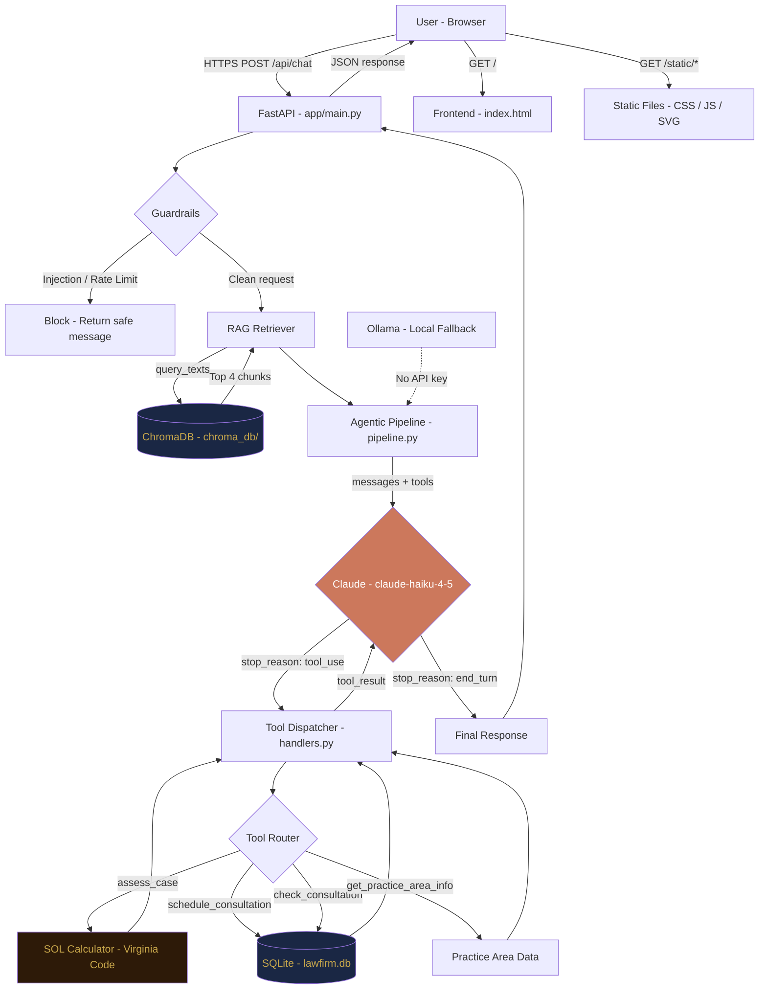
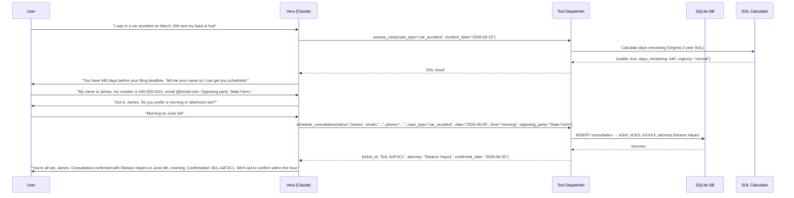

# Billie Jean Law — AI Intake Demo

**The problem:** 42% of law firm calls go unanswered. Every one is a potential client. Small firms in Fredericksburg lose cases to competitors not because they are less capable, but because the phone rings after hours or the intake form never gets followed up.

**The solution:** Vera — an agentic AI intake specialist that answers 24/7, calculates Virginia statute of limitations deadlines in real time, triages urgency, performs conflict-of-interest checks, and books free consultations directly into the firm's system. No hold music. No missed opportunities.

**Live demo:** [Deployed on Railway]

---

## What Vera Can Do

- Qualify the type of legal matter (personal injury, family law, criminal defense, estate planning)
- Calculate Virginia SOL deadlines from the incident date and flag critical urgency
- Detect emergency situations: active domestic violence, court dates within 2 weeks, SOL expiring in 30 days
- Book free 30-minute consultations, routed to the right attorney by case type
- Pull detailed practice area info including fees, timelines, and what to bring
- Look up existing consultations by name, phone, email, or ticket ID
- Read responses aloud via TTS (Web Speech API) and accept voice input via STT

---

## System Architecture



---

## Agentic Tool Loop



---

## Virginia SOL Engine

The `assess_case` tool computes Virginia statute of limitations in real time:

| Case Type | Virginia SOL | Code |
|---|---|---|
| Personal Injury | 2 years | Va. Code § 8.01-243(A) |
| Wrongful Death | 2 years | Va. Code § 8.01-244 |
| Medical Malpractice | 2 years | Va. Code § 8.01-243(C) |
| Property Damage | 5 years | Va. Code § 8.01-243(B) |
| Breach of Contract | 5 years | Va. Code § 8.01-246(2) |

**Urgency tiers:**

| Days Remaining | Urgency | Vera's Response |
|---|---|---|
| > 180 | normal | Standard intake flow |
| 91-180 | moderate | Prompt to schedule soon |
| 31-90 | high | Expedite booking this week |
| 1-30 | critical | Flag immediately, offer direct line |
| 0 or negative | expired | Discuss tolling exceptions |

---

## Project Structure

```
billie_jean_law/
├── app/
│   ├── config.py              # Pydantic settings, .env loader
│   ├── main.py                # FastAPI app, guardrails, rate limiting, session history
│   ├── rag/
│   │   ├── ingest.py          # ChromaDB ingestion from knowledge_base/
│   │   ├── pipeline.py        # Agentic loop (Claude) + Ollama fallback
│   │   └── retriever.py       # ChromaDB semantic search
│   └── tools/
│       ├── definitions.py     # Anthropic tool_use JSON schemas
│       ├── handlers.py        # Tool execution + SOL calculator
│       └── mock_db.py         # SQLite schema, seed data, CRUD
├── frontend/
│   ├── index.html             # Landing page + chat widget
│   └── static/
│       ├── app.js             # Chat logic + TTS + STT (Web Speech API)
│       ├── style.css          # Dark navy + gold design system
│       └── favicon.svg        # Scales of justice SVG
├── knowledge_base/
│   ├── practice_areas.txt     # PI, family, criminal, estate — Virginia-specific
│   ├── faq.txt                # Fees, process, what to bring, timelines
│   └── virginia_law.txt       # SOL table, DUI law, divorce, custody, courts
├── mcp_server.py              # FastMCP server exposing 4 tools via stdio
├── requirements.txt
├── Procfile                   # Railway/Heroku deployment
├── railway.json               # Railway build + deploy config
├── .env.example               # Template (no real keys)
└── .gitignore
```

---

## Agentic Tools

| Tool | Purpose | Key Logic |
|---|---|---|
| `assess_case` | Virginia SOL check | Computes deadline from incident date, returns urgency tier |
| `schedule_consultation` | Book free consult | Routes to correct attorney by case type, returns ticket ID |
| `check_consultation` | Look up existing | Search by name / phone / email / ticket ID |
| `get_practice_area_info` | Practice area details | Fees, attorney, timeline, what to bring, VA-specific notes |

---

## MCP Server

Exposes all 4 tools via FastMCP stdio transport for integration with Claude Desktop or any MCP-compatible client:

```bash
python mcp_server.py
```

Tools available: `assess_case`, `book_consultation`, `lookup_consultation`, `practice_area_info`

---

## Security

- 23 regex injection patterns blocking prompt injection, XSS, SQL injection
- Session ID format validation
- Input length enforced: 1-600 characters
- Session rate limit: 25 messages per 5 minutes
- IP rate limit: 120 requests per hour (X-Forwarded-For aware)
- Output capped at 2000 characters
- `.env` gitignored; `.env.example` always has empty `ANTHROPIC_API_KEY=`

---

## Local Setup

```bash
# 1. Clone and install
git clone https://github.com/akabonge/lawfirm
cd billie_jean_law
python -m venv .venv && source .venv/bin/activate  # Windows: .venv\Scripts\activate
pip install -r requirements.txt

# 2. Configure environment
cp .env.example .env
# Edit .env and add your ANTHROPIC_API_KEY

# 3. Run
uvicorn app.main:app --reload --port 8002

# Open http://localhost:8002
```

---

## Railway Deployment

1. Push to GitHub
2. Create a new service in Railway pointing to this repo
3. Add environment variable: `ANTHROPIC_API_KEY=your_key`
4. Railway auto-detects `railway.json` and deploys

---

## Tech Stack

| Layer | Technology |
|---|---|
| Backend | FastAPI, Python 3.11+ |
| LLM | Claude Haiku (Anthropic) |
| Tool Use | Anthropic native tool_use API |
| Vector DB | ChromaDB (persistent) |
| Embeddings | sentence-transformers (all-MiniLM-L6-v2) |
| Relational DB | SQLite |
| MCP | FastMCP (stdio transport) |
| Voice | Web Speech API (TTS + STT) |
| Frontend | Vanilla JS + CSS, Plus Jakarta Sans |
| Deployment | Railway (Nixpacks) |

---

## Demo Context

Part of the [AI Alo](https://aialo.io) portfolio — AI automation demos for local businesses in Fredericksburg, VA.

> "Every missed call is a case that walked to the next firm."
